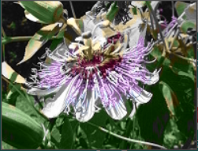
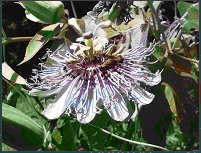
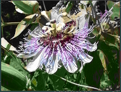
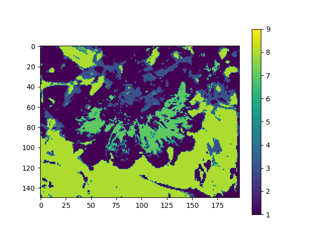
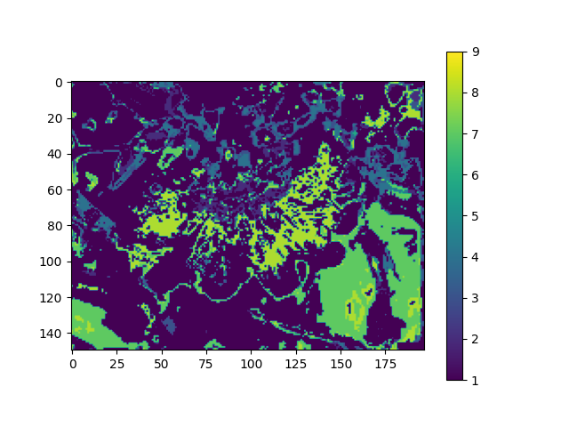

# ColorRL
Interesting image colorization agent

`If it helps you with your research, please star it. 🎈`

# Requirements and Dependencies
- pytorch 1.9.0
- python 3.6

# Visualization
----------
* Colorization

   
   
   
* Color Mask
   
  
  
